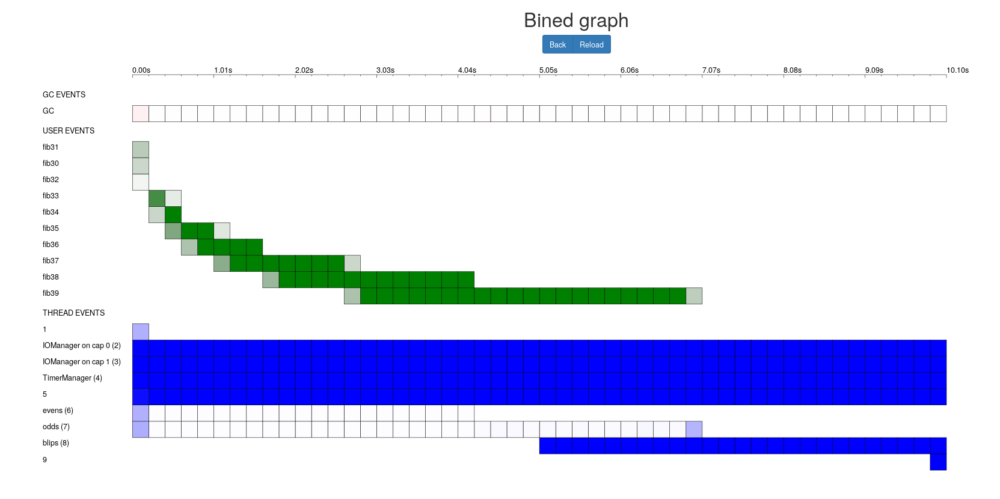

# live-profile-server

This repo is part [Haskell Summer of Code 2016](https://summer.haskell.org) project called "Live profiling and performance monitoring server".

It is a web based application that provides management and analytic tools for event logs got by manual upload or by [live-profile-monitor](https://github.com/NCrashed/live-profile-monitor).

The following screen presents [ghc-events-analyze](http://www.well-typed.com/blog/86/) like diagram for program of Fibonacci calculation (see the original blog post).



## Building 

At the moment, the prefered method of building the server is [stack](https://docs.haskellstack.org/en/stable/README/):
```
stack install
cd live-profile-frontend
./compile.sh
```

If you desire to build test application (if you want live profiling, you need [patched](https://phabricator.haskell.org/D2522) ghc and [live-profile-monitor](https://github.com/NCrashed/live-profile-monitor)):
```
cd live-profile-test-app
stack install --pedantic --compiler=ghc-8.1
```

Also you need a PostgreSQL instance, for connection options see [configuration](blob/master/live-profile-server-backend/config/config.yaml) of the server backend:

``` yaml
# Values formatted like "_env:ENV_VAR_NAME:default_value" can be overridden by the specified environment variable.
database:
  database: "_env:POSTGRES_DB:postgres"
  host: "_env:POSTGRES_PORT_5432_TCP_ADDR:localhost"
  port: "_env:POSTGRES_PORT_5432_TCP_PORT:5432"
  user: "_env:POSTGRES_USER:postgres"
  password: "_env:POSTGRES_PASSWORD:'123456'"
  poolSize: "_env:POSTGRES_POOL_SIZE:8"
```

## Design 

The repo is splitted into 6 packages:

* [live-profile-server-api](tree/master/live-profile-server-api) - server [servant](http://haskell-servant.readthedocs.io/en/stable/) API specification shared between backend and frontend. A [swagger](http://swagger.io/) specification and docs are automatically extracted from the API.

* [live-profile-server-backend](tree/master/live-profile-server-backend) - server backend, that implements the API above. It handles connections to monitors, uploading of files, storage in RDBMS and authorisation. 

* [live-profile-server-frontend](tree/master/live-profile-server-frontend) - GHCJS + [reflex + reflex-dom](https://github.com/reflex-frp/reflex-platform#Tutorial) web frontend.

* [live-profile-test-app](tree/master/live-profile-test-app) -
debug application that can be used to test live profiling.

* [servant-rest-derive](tree/master/servant-rest-derive) - auxiliary library that provides automatic REST deriving for [vinyl](http://hackage.haskell.org/package/vinyl) records.

* [servant-rest-derive-server](tree/master/servant-rest-derive) - auxiliary library that provides automatic [persistent](http://hackage.haskell.org/package/persistent) support for [vinyl](http://hackage.haskell.org/package/vinyl) records.

## TODO 

* Add instruction for `cabal-new-build` method of building.